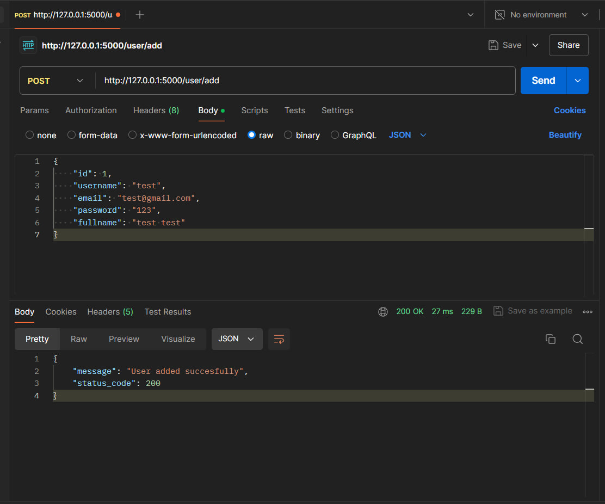
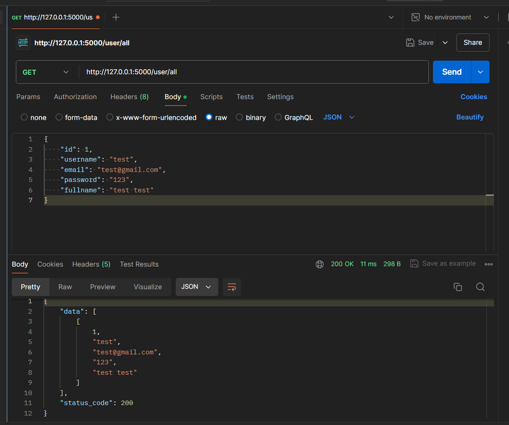
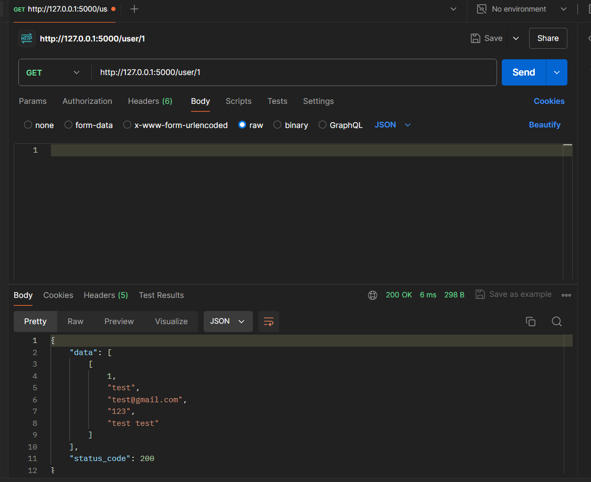
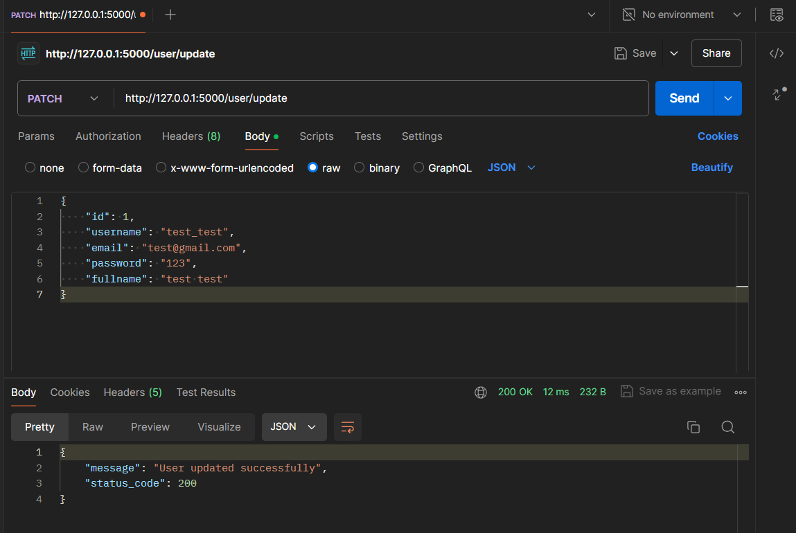
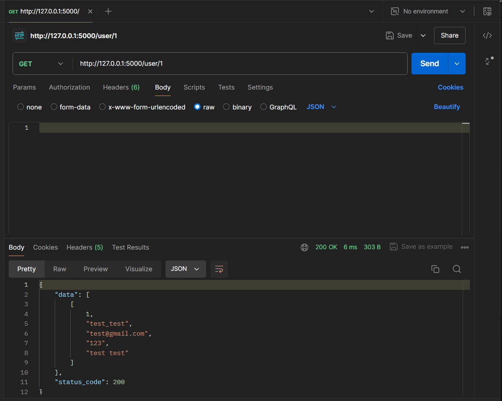
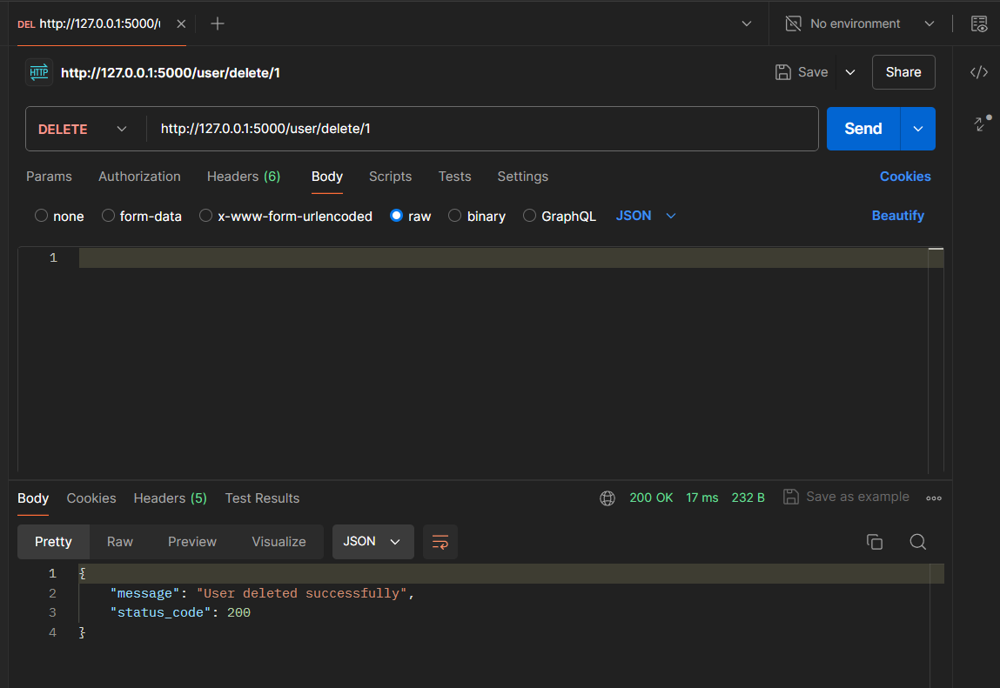
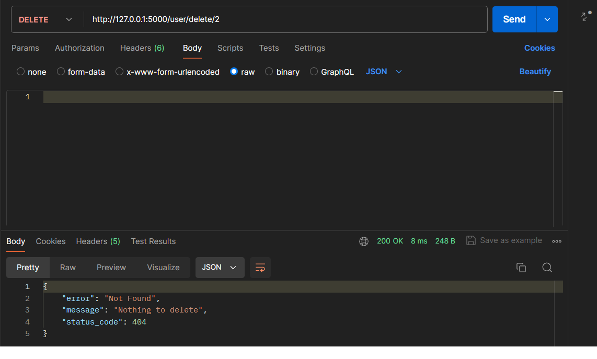

# Тестування працездатності системи

Тестування сервісу проводилося за допомогою Postman.

## POST /user/add

    

## GET /user/all

    

## GET /user/:id

    

## PATCH /user/update

    

## GET /user/:id

    

## DELETE /user/delete/:id

    

## EXCEPTION: nothing to delete

    

